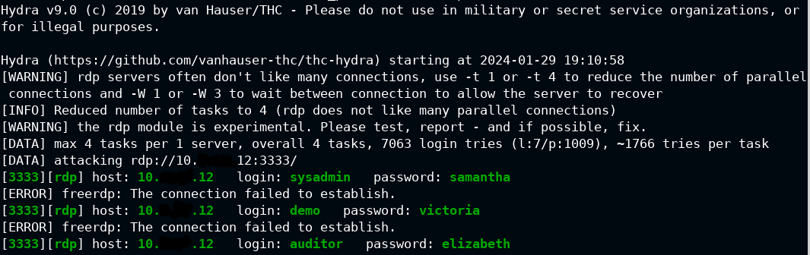

# Hydra-Brute-Forcing
Let's introduce the Hydra tool

# Introduction of the tool
## Hydra
Hydra is a tool that can perform brute-force attacks on various network services, such as telnet, FTP, HTTP, SSH, RDP and more. It can use a dictionary of passwords or generate them on the fly. Hydra is very fast and flexible, and it is often used by penetration testers and ethical hackers to crack passwords and gain unauthorized access to systems

Options:
  - -R        **restore a previous aborted/crashed session**
  - -I        **ignore an existing restore file (don't wait 10 seconds)**
  - -S        **perform an SSL connect**
  - -s PORT   **if the service is on a different default port, define it here**
  - -l LOGIN or -L FILE  **login with LOGIN name, or load several logins from FILE**
  - -p PASS  or -P FILE  **try password PASS, or load several passwords from FILE**
  - -x MIN:MAX:CHARSET  **password bruteforce generation, type "-x -h" to get help**
  - -y        **disable use of symbols in bruteforce, see above**
  - -e nsr    **try "n" null password, "s" login as pass and/or "r" reversed login**
  - -u        **loop around users, not passwords (effective! implied with -x)**
  - -C FILE   **colon separated "login:pass" format, instead of -L/-P options**
  - -M FILE   **list of servers to attack, one entry per line, ':' to specify port**
  - -o FILE   **write found login/password pairs to FILE instead of stdout**
  - -b FORMAT **specify the format for the -o FILE: text(default), json, jsonv1**
  - -f / -F   **exit when a login/pass pair is found (-M: -f per host, -F global)**
  - -t TASKS  **run TASKS number of connects in parallel per target (default: 16)**
  - -T TASKS  **run TASKS connects in parallel overall (for -M, default: 64)**
  - -w / -W TIME  **wait time for a response (32) / between connects per thread (0)**
  - -c TIME   **wait time per login attempt over all threads (enforces -t 1)**
  - -4 / -6   **use IPv4 (default) / IPv6 addresses (put always in [] also in -M)**
  - -v / -V / -d  **verbose mode / show login+pass for each attempt / debug mode**
  - -O        **use old SSL v2 and v3**
  - -q        **do not print messages about connection errors**
  - -U        **service module usage details**
  - -h        **more command line options (COMPLETE HELP)**
  - server    **the target: DNS, IP or 192.168.0.0/24 (this OR the -M option)**
  - service   **the service to crack (see below for supported protocols)**
  - OPT       **some service modules support additional input (-U for module help)**

Supported services: adam6500 asterisk cisco cisco-enable cvs firebird ftp[s] http[s]-{head|get|post} http[s]-{get|post}-form http-proxy http-proxy-urlenum icq imap[s] irc ldap2[s] ldap3[-{cram|digest}md5][s] memcached mongodb mssql mysql nntp oracle-listener oracle-sid pcanywhere pcnfs pop3[s] postgres radmin2 rdp redis rexec rlogin rpcap rsh rtsp s7-300 sip smb smtp[s] smtp-enum snmp socks5 ssh sshkey svn teamspeak telnet[s] vmauthd vnc xmpp etc.

 

## Example of RDP brute force with Hydra  
**Command:**
hydra -L /usr/share/metasploit-framework/data/wordlists/common_users.txt -P /usr/share/metasploit-framework/data/wordlists/unix_passwords.txt rdp://ip -s 3333 (in my case the RDP port is 3333 and i used metasploit user and password list) 
**Output**
  

Hydra supports a lot of protocols, the most famous are:SMB, HTTP, RDP, SSH, FTP, MySQL, etc.

#Author
<b>Xiao Li Savio Feng</b>
